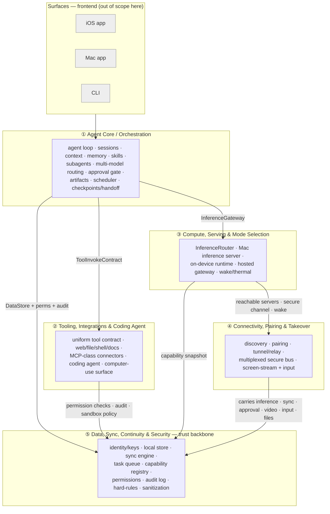

# Mahi AI — Backend Build Plan

> **Status:** Draft architecture plan · **Date:** 2026-06-11 · **Repo state at authoring:** greenfield (empty)
>
> This document is the synthesis of **five parallel architecture passes**, one per backend
> domain. Each pass produced a detailed design (see [`domains/`](./domains/)); this README
> reconciles them into one coherent system, defines the seams between them, sequences the
> deferred technology decisions, and lays out a dependency-aware build roadmap.
>
> It deliberately follows the source feature spec's rule: **no premature technology lock-in.**
> Specific runtimes/models/protocols are framed as candidate options with trade-offs and a
> recommended decision order — to be resolved per area when that area is built.

---

## 1. Context — why this plan exists

Mahi AI is a multi-surface personal AI assistant (iOS, Mac, CLI, shared agent core). Its
defining concept is **four compute modes** that the app auto-selects and degrades between:

| Mode | What it is |
|---|---|
| **A — On-device** | Small model on the iPhone, fully offline (airplane-mode provable) |
| **B — Mac LAN** | Phone uses your Mac as the brain over the local network (big models, full tools) |
| **C — Mac remote** | Same as B, from anywhere, over a secure tunnel (no port forwarding) |
| **D — Hosted** | Cloud model API when no Mac is available |

The product feature spec is intentionally **tech-neutral** and defers every framework/model/
protocol choice. This plan therefore describes the backend in terms of **components,
responsibilities, and interfaces**, so the surfaces (UI) and the deferred tech can be slotted
in later without re-architecting.

**Scope of "backend" here:** the shared agent core, the tool/capability surface, the compute &
serving layer (modes A–D), the device-to-device connectivity layer, and the data/sync/security
backbone. **Out of scope:** UI/frontend for iOS/Mac/CLI (their framework choices are deferred),
and the §8 "beyond your devices" surfaces (web client, messaging bridges, multi-user) which are
explicitly later.

---

## 2. Architecture at a glance

Five layers. The **Agent Core** is the brain; everything else is something the core *consumes*
(compute, tools, persistence) or something that *carries the core across devices* (connectivity).
The **Data/Sync/Security** layer is the trust backbone that sits under everything.

---

## 3. The five domains

| # | Domain | Owns | Detail |
|---|---|---|---|
| ① | **Agent Core / Orchestration** | The agent loop and all session/context/memory/skill/subagent state; routing; the approval gate; mode-handoff via serializable checkpoints | [01-agent-core](./domains/01-agent-core.md) |
| ② | **Tooling, Integrations & Coding Agent** | Every capability the core can invoke under one uniform contract; MCP-class connectors; the coding agent; the computer-use capability + safety surface | [02-tooling-integrations](./domains/02-tooling-integrations.md) |
| ③ | **Compute, Serving & Mode Selection** | Where inference runs and how the best mode is chosen; Mac server, on-device runtime, hosted gateway; the auto-select/degrade engine | [03-compute-serving](./domains/03-compute-serving.md) |
| ④ | **Connectivity, Pairing & Takeover** | All device-to-device transport: discovery, pairing, tunnels, and a single multiplexed encrypted bus that carries everything — including live Mac screen-streaming | [04-connectivity-takeover](./domains/04-connectivity-takeover.md) |
| ⑤ | **Data, Sync, Continuity & Security** | The trust backbone: identity/keys, local-first storage, E2E sync, cross-device task queue, capability registry, permissions, audit, hard-rules | [05-data-sync-security](./domains/05-data-sync-security.md) |

> The module/file paths inside each domain doc are **illustrative** of the intended decomposition;
> actual paths/languages depend on **Decision #0** (§5).

---

## 4. Cross-domain contracts — the seams

The value of designing in five passes is only realized if the interfaces mate. They largely do.
This table names the **canonical contract** for each seam and notes the reconciliations needed
(minor naming/ownership clarifications). Lock these contracts first (Phase 0) so the domains can
be built in parallel afterward.

| Seam | Canonical interface | Direction | Reconciliation note |
|---|---|---|---|
| Core → Compute | **`InferenceGateway`** (facade) implemented by `InferenceRouter`, which selects among `InferenceProvider`s | Compute serves Core | Core's `stream_completion` ≡ Compute's `generate(InferenceRequest) → AsyncStream<InferenceChunk>`. **Every chunk echoes `activeMode`.** Core's `get_capabilities` ≡ Compute's `descriptor()`/`canHandle()`. |
| Core → Tooling | **`ToolInvokeContract`**: `describe()` / `invoke(call) → stream` / `cancel()` + an approval flag | Tooling serves Core | Unify the two names used: `ToolCall`≡`ToolInvocation`, `ToolEvent`≡`ToolResultChunk`. Both carry `requiresApproval` / `destructive_level`. |
| Core / Tooling → Data | **`DataStore`**: CRUD + `subscribe` + `semantic_search` | Data serves all | Data's `LocalStore` fulfills it for conversations, memory, skills, tasks, checkpoints, artifacts. |
| Tooling → Data | **`PermissionService.check()`**, **`AuditLog.append()`**, read **`SandboxPolicy`** + `HardRule`s | Data serves Tooling | Tooling emits a permission check + an `AuditEvent` per invocation and reads sandbox/hard-rule policy *before* executing. |
| Compute → Connectivity | **`reachableServers() → [ServerDescriptor]`**, `secureChannel(to:)`, `sendWakeSignal()` | Connectivity serves Compute | **Ownership split:** Connectivity owns reachability + latency + a *coarse* load hint (`PeerDescriptor`); Compute enriches into `ServerDescriptor` (models, VRAM, thermal, queue depth). Connectivity owns the heartbeat-freshness TTL. |
| Compute → Data | **`DeviceCapabilitySnapshot`** → `CapabilityRegistry` | Compute publishes | Tooling publishes its tool capabilities to the *same* registry, so the core can route by "which device can do what." |
| Connectivity → everyone | **`MultiplexedBus`** with fixed logical channels: `CONTROL · INFERENCE · SYNC · APPROVAL · STREAM_VIDEO · INPUT · FILE_XFR · AUDIO` | Connectivity transports; others own payloads | `SYNC` carries Data's opaque encrypted `SyncEnvelope`; `APPROVAL` carries Core's `ApprovalRequest`; `INFERENCE` carries Compute streams; `STREAM_VIDEO`/`INPUT` carry Tooling's computer-use. |
| Tooling (computer-use) ↔ Connectivity | frames on `STREAM_VIDEO`, `InputEvent` on `INPUT`; the `agentGenerated` flag is **advisory** | both | Tooling/safety enforces the login/payment approval wall; Connectivity only labels + carries. The kill-switch lives on the highest-priority `CONTROL` channel. |

---

## 5. Decision #0 — the shared-core language/runtime (make this first)

The five passes split on implementation language (some assumed TypeScript, some Swift). That split
is not noise — it maps to a **real architectural boundary** and is the single most foundational
decision, because it is gated by one hard requirement:

> **Mode A requires the agent core to run *on the iPhone itself*, fully offline.**

That forcing function shapes the answer:

| Option | Pros | Cons |
|---|---|---|
| **Rust portable core + thin Swift native shims** *(recommended)* | One core compiles natively to iOS/macOS/Linux (via UniFFI), as an embeddable lib *and* a headless CLI/daemon; Rust is strong exactly where this product is hard — crypto, sync, QUIC/tunnels, sandboxing | Slower iteration than TS; smaller AI/agent ecosystem; needs FFI bridging to Swift/Kotlin |
| **TypeScript/Node core** | Fastest iteration; richest agent/MCP ecosystem; great for Mac/CLI/hosted | **Weak on-device story** — running a full agent loop on iOS means an embedded JS engine; mode-A core would likely diverge into a second implementation |
| **Swift core** | Native iOS/Mac; MLX & Foundation Models native | Weak as a Linux/headless CLI + server; awkward to share with non-Apple targets |

**Recommended shape:** a **portable Rust core** (orchestration, tooling logic, data/sync/crypto,
mode-selection, and the QUIC/tunnel transport — note `boringtun`, `quinn`, `libp2p` are all Rust)
behind a stable FFI, plus **thin Swift shims** only for the genuinely Apple-native I/O: VideoToolbox
H.265 capture/encode, MLX / Foundation Models on-device inference, ScreenCaptureKit, IOKit thermal,
Bonjour/mDNS, and Keychain/Secure Enclave. This is the "Rust core + native shell" pattern and it is
what lets modes A/B/C/D share one brain.

**Decide this before writing any cross-domain code**, because it determines whether the Phase-0
contract types are authored once (Rust) or duplicated.

---

## 6. Compute-mode selection — and one ambiguity to resolve

The mode-selection engine (`InferenceRouter`, domain ③) takes reachable servers, on-device state,
network quality, cost/power preferences, and any user **pin**, and returns a selected mode +
provider, echoing `activeMode` on every token and emitting an explicit **pin-violation event**
rather than ever silently falling back when a pin can't be honored.

**Open question for you:** the spec writes the order as **"D→C→B→A,"** but the *local-first* ethos
and domain ③'s design imply the opposite *preference*: prefer the local Mac on LAN (B), then remote
Mac (C), then on-device (A) / hosted (D). These are two different things — a **preference order**
("best available") vs. a **degradation direction** ("what to fall back to"). We need your intended
preference, especially: **when a Mac is reachable, is it always preferred over hosted (D)?** (Local-first
says yes.) And **is on-device (A) the privacy-preferred default when offline, or the last resort?**
This single answer parameterizes the whole router policy. *(Listed again in §10.)*

---

## 7. Consolidated deferred-technology decisions (in resolution order)

Each domain framed its own deferred choices; merged and globally ordered, with the recommended
default per item. Items above the line block the MVP.

| # | Decision | Recommended default (revisit when built) | Blocks |
|---|---|---|---|
| 0 | **Shared-core language** | Rust portable core + Swift native shims (§5) | Everything |
| 1 | **Local store** | SQLite + SQLCipher | All persistence |
| 2 | **Agent-loop tool-call representation** | Provider-neutral internal type + thin per-backend adapters | ToolBridge |
| 3 | **On-device runtime (mode A)** | Apple Foundation Models as the zero-download bootstrap; MLX Swift for user-downloaded models; CoreML for battery-critical | Mode A |
| 4 | **Mac serving stack** | Ollama (OpenAI-compatible daemon) → pluggable `MacServingBackend`, add MLX-LM later | Modes B/C |
| 5 | **Hosted provider abstraction** | OpenAI-compatible wire format as canonical + thin adapters (Anthropic/Google) | Mode D |
| 6 | **P2P transport + handshake** | QUIC (connection migration matters on mobile) + Noise_XX over the pairing key | All device-to-device |
| 7 | **LAN discovery** | mDNS/DNS-SD (Bonjour) + UDP-broadcast fallback for restricted Wi-Fi | Pairing, mode B |
| — | — | — | — |
| 8 | **NAT traversal / tunnel** | WireGuard (`boringtun`) + self-hostable coordinator; QUIC hole-punch for direct | Mode C |
| 9 | **Relay fallback** | `coturn`-compatible self-hostable relay (untrusted, ciphertext only) | Mode C reliability |
| 10 | **Sync engine / merge** | Automerge (CRDT); consider split — CRDT for conversations/memory, LWW log for settings | Multi-device sync |
| 11 | **Encryption + key management** | HKDF + AES-256-GCM per record now; evaluate **MLS (RFC 9420)** for multi-device key agreement | Sync security |
| 12 | **Screen-streaming codec** | H.265 via VideoToolbox in custom QUIC framing (not full WebRTC); AV1 as a quality mode | Takeover |
| 13 | **Context compaction** | Hierarchical summarization on Mac/cloud; aggressive sliding-window on-device | Long conversations |
| 14 | **Sandboxing** | macOS App Sandbox + seccomp profile → Firecracker for cloud exec; WASI for doc-gen | Shell/code tools |
| 15 | **Connector protocol** | MCP as baseline; wrap custom connectors in an MCP-compatible shim | Connectors |
| 16 | **Subagent isolation** | In-process with a budget/timeout → OS-process for high-risk later | Subagents |
| 17 | **Key-recovery model** | **Product decision — see §10** | Sync trust model |

---

## 8. Unified build roadmap

The critical move is **Phase 0**: lock the seam contracts (§4) and the trust backbone first, so the
five domains can then progress largely in parallel. Each later phase lights up one compute mode.

### Phase 0 — Foundations & contracts
- Resolve Decision #0 (core language) + #1 (local store).
- Author the **shared contract types**: `InferenceGateway`, `ToolInvokeContract`, `DataStore`, the `MultiplexedBus` envelope, and the permission/audit/hard-rule interfaces.
- Stand up the **trust backbone, single-device**: local store, identity (one device), permission service, hash-chained audit log, hard-rules engine, sanitization hooks.

### Phase 1 — MVP: single-device assistant (modes A + D)
- **Core:** streaming agent loop, sessions, sliding-window context, static routing.
- **Compute:** on-device runtime (Apple Foundation Models) + hosted gateway (one provider); 2-mode router (A/D); active-mode display.
- **Tooling:** tool registry + uniform contract; web search/fetch (+ citations) + phone file tools; App-Sandbox shell; action-logger → audit.
- **Data:** local-only store, first-use permission prompts, audit, hard rules.
- **Outcome:** a working local-and-cloud assistant on one device, with permissions and audit. No Mac, no sync, no takeover.

### Phase 2 — The Mac brain over LAN (mode B)
- **Connectivity:** mDNS discovery, QR pairing (Noise_XX), trust store, QUIC `SecureChannel` (LAN direct), `CONTROL`+`INFERENCE` channels, session manager (idle timeout + kill-switch).
- **Compute:** Mac inference server (Ollama daemon), wake-on-LAN, thermal/power monitor; full 4-mode router policy.
- **Core:** mode-handoff via checkpoints (A↔B↔D); subagents; full tool access on Mac.
- **Tooling:** full Mac file tools; coding agent (synchronous); more MCP connectors.
- **Outcome:** the phone uses the Mac's brain on the LAN; conversations hand off seamlessly; coding agent works.

### Phase 3 — Sync, continuity & remote (mode C)
- **Data:** sync engine (CRDT) + cross-device identity enrollment/key exchange; cross-device task queue; capability registry; checkpoint sync.
- **Connectivity:** tunnel coordinator (WireGuard + coordinator) + relay (coturn) fallback; `SYNC` + `APPROVAL` channels; reconnection semantics.
- **Tooling:** background/long-running coding jobs, observable cross-device; headless mode (drive from phone).
- **Outcome:** start-anywhere/continue-anywhere; reach your Mac from anywhere; remote approvals.

### Phase 4 — Mac takeover (the flagship, §5.4)
- **Connectivity:** screen-stream pipeline (H.265/VideoToolbox + QUIC framing), input-control channel, `FILE_XFR`, approval-broker with rich previews, "phone is controlling" indicator, adaptive frame rate.
- **Tooling:** computer-use engine (Accessibility API + Vision OCR), per-app permission tiers, action log, login/payment safety walls.
- **Outcome:** watch *and* steer the Mac live from the phone; hybrid manual/agent control — **the differentiator.**

### Phase 5+ — Hardening & scale (later)
Hierarchical summarization; semantic memory (vector index); nested/parallel subagents with budgets;
scheduled/recurring tasks running on the Mac while the phone is off; MLX-LM serving backend; CoreML
battery path; connector marketplace + manifest signing; multi-Mac load routing; key-recovery
mechanism; audit cross-signing; AV1 quality mode; audio forwarding; and the §8 surfaces (web client,
messaging bridges, multi-user).

---

## 9. Consolidated top risks (cross-domain)

| Risk | Where | Mitigation direction |
|---|---|---|
| **Approval-gate deadlock** when the approver device is offline | Core + Data + Connectivity | Durable `AwaitingApproval` park state + timeout policy (auto-deny critical, auto-allow low after N min) |
| **Key loss vs. zero-knowledge recovery** | Data | Hardest product call — see §10; design the key-rotation/recovery interface before v1 |
| **Offline-provability of mode A** | Compute + Data | Build-time constraint (no background-network entitlement in local-only); reserve the "verified offline" badge for downloaded models, since Apple FM telemetry is out of our control |
| **Sandbox escape + prompt-injection via tool results** | Tooling + Data | No network/host-FS by default; output caps + kill timeout; sanitize tool results; separate "data" from "instructions" |
| **Takeover latency + NAT/relay reliability** | Connectivity | Profile glass-to-glass on real hardware before codec lock-in; symmetric-NAT (~15–20%) needs seamless automatic relay |
| **Capability mislabeling** (small model claims tools it can't do) | Compute | Validate caps with a benchmark at model load, not metadata; `capabilityVerified` flag |
| **Checkpoint fidelity mid-tool-call** on mode switch | Core + Tooling | Define a restart-safe tool contract; decide resume-vs-restart semantics |
| **Kill-switch under saturated channels** | Connectivity | `CONTROL` channel priority scheduling so kill fires even if video/input are saturated |

---

## 10. Decisions needed from you

These are the product-level calls that change the architecture (everything else is a deferrable
tech choice with a sensible default in §7):

1. **Shared-core language (§5)** — adopt *Rust portable core + Swift native shims* (recommended), or prefer a TypeScript core and accept a separate native mode-A implementation?
2. **Mode-preference order (§6)** — confirm the local-first intent: prefer Mac-LAN (B) > Mac-remote (C) > hosted (D), with on-device (A) as the offline/privacy default? Or is the literal "D→C→B→A" the intended *preference*?
3. **Key-recovery model** — zero-knowledge (lose the key ⇒ lose the data), passphrase-wrapped backup, or iCloud-Keychain-assisted (convenient but breaks pure zero-knowledge)? This touches every synced byte.
4. **Build priority** — is the phase order right, or should **Mac takeover (Phase 4)** jump earlier given it's the stated market differentiator?

---

## 11. Suggested next step

When you've picked a direction on the §10 questions, the natural next move is to **spin up a second
round of agents — one per phase or per domain — to produce the implementation-level plan** (concrete
module layout, the contract type definitions in the chosen language, and a task breakdown) for
whichever slice you want to build first. Phase 0 (lock the contracts + trust backbone) is the
recommended starting point regardless of the §10 answers.
